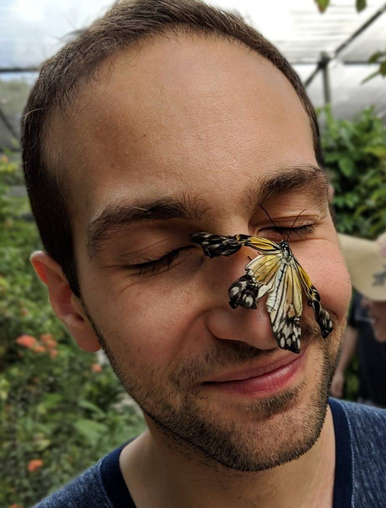

# Hi! I'm Hussein.

I've been in the software industry for 13 years. I have worn many hats: been an IC, done systems design, led teams, mentored junior engineers, done R&D, and championed career advancement and learning.

## The kinds of work I love

### Learn -> explore -> teach

I love learning complex systems, exploring data to come up with ideas and test hypotheses, and then sharing what I've learned. I find teaching extremely rewarding. My presentation style is curious, familiar, and conversational: why not read my [crash course on genomics for computer scientists](https://docs.google.com/document/d/1-C_BI4mx0Amjxac7G908Wtmfuc_N8O4_UqSDPiZu_bo/edit?usp=sharing), or my [writeup on the inner workings of options markets](https://helgridly.github.io/finstuff/understanding-NOPE/)? If those aren't for you, you'll find other instances of my writing over a wide range of topics on the [Writing](/writing) page.

### Designing and building systems

I enjoy designing and building systems to achieve specific goals -- and not just technical ones!

In 2018 I took a three month sabbatical to investigate lossy compression of sequencing data, and **created a new file format 4% the size of its source file** and ~28% the size of its lossy competitor. I presented these results at the Global Alliance for Genomics & Health's 6th Plenary Meeting in Basel, Switzerland; watch [the talk](https://www.youtube.com/watch?v=TaqFBgaZHmE&t=13920s) or flip through [the slides](https://docs.google.com/presentation/d/1EAG3Mz_Rwszn1xzvLFlFDtZJKeTfTcqo/edit).

In 2019 I led an effort with engineering managers to rethink our software engineering levels. (needs writeup, TBD; link to Trello)

You can find more information on these and other projects over on the [Projects](/Projects) page.

### Growing engineers

Leading teams and mentoring and growing developers has been the most rewarding part of my career so far. I have experience building great teams, I lead a great interview (see [my interviewing tips](https://docs.google.com/document/d/1qNeXN_E_na_KXsZMaXRfYQcoT-0w59yjdmN1B7Tst68/edit#)), and I care deeply about the (oft-ignored) new hire onboarding experience. As mentioned above, I've thought deeply about designing software engineering levels for clarity and good feedback, and I've also [pitched](https://docs.google.com/presentation/d/1dgl6OwC9FHX-6oT9Z1JCmPglDmW9umv0/edit?usp=sharing&ouid=114804907504664516654&rtpof=true&sd=true) and launched a [10% time policy](https://docs.google.com/document/d/1z81KCX6tuKLnSct5oFamhEvcFCJIPGOL/edit?usp=sharing&ouid=114804907504664516654&rtpof=true&sd=true).

## Could you be my dream job?

I'd love to apply my skills and enthusiasm in a way that's rewarding and helpful. My career so far has been directly in tech, but the most important thing to me is that the work I do makes a meaningful, tangible (positive!) difference in people's lives.

In that context, I could see myself flourishing:

* Doing technical research / advisory work for policy groups
* Running an R&D team where all new hires first land, blending onboarding and experimentation
* Being an organization's go-to person for engineering career progression: onboarding, levelling / promotions, professional development / continuing education, mentoring, etc

How does that sound? 🙂 I'd love to hear from you: `hussein@thisdomain`
